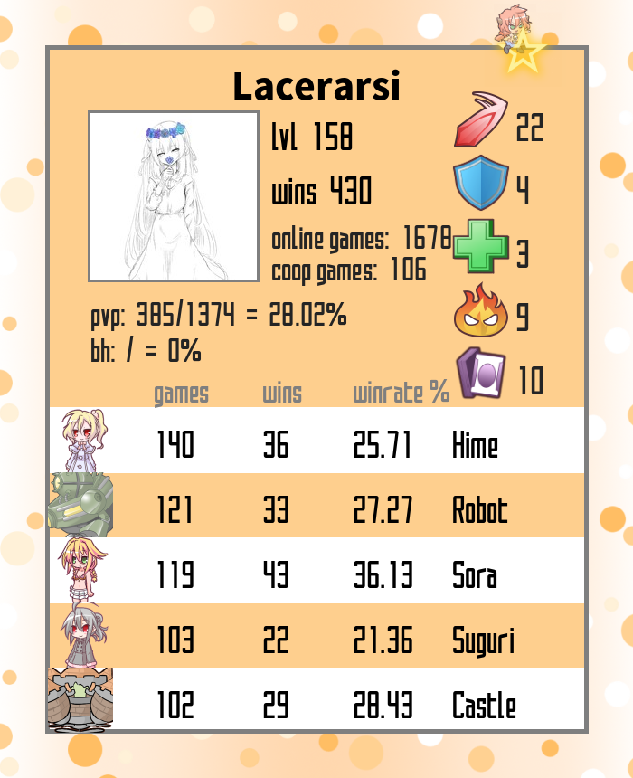

      English | <a href="README-CN.md">中文</a>

    <em>100% Orange Juice Stats</em>

# 100% Orange Juice Stats
This project is an enhanced version of [orange-juice-stats](https://gitlab.com/gabuch2/orange-juice-stats).   

I build this repo in order to make it easier to look up global stats and player stats.   
Deploying it on 100oj.com making it part of the many Orange Juice tools available, in early 2021.    

   

   

   

   

# Setup

## Setup from source
1. PHP 7.0 or higher   
2. Get your api key on [Steam](https://steamcommunity.com/dev). And set it in ``config.php``.   
3. (optional) If you use the content under renders/ to render images, set up [imagick](https://www.php.net/manual/en/imagick.setup.php).   

#### 3.1 Checkout your php version.
Run ``php -v`` to see what version of PHP you have on the machine.   

#### 3.2 Enable GD extension for PHP.
``sudo apt-get install php<your-php-version>-gd``,   
e.g. ``sudo apt-get install php8.1-gd``.

#### 3.3 Set up imagick.
``sudo apt-get install php<your-php-version>-imagick``,   
e.g. ``sudo apt-get install php8.1-imagick``.

## Or setup use docker
see [OrangeJuice-Stats-Docker](https://github.com/Hanekihyouka/OrangeJuice-Stats-Docker).   

# Public Instance

[global.php](https://interface.100oj.com/stat/global.php) for global stats

[player.php](https://interface.100oj.com/stat/player.php) for player stats

``render.php`` for generate image of player stats.   
``https://interface.100oj.com/stat/render.php?steamid=<steamid>``   
or ``https://interface.100oj.com/stat/render.php?steamid=<steamid>&limit=<rows>&render=<typeid>``   

``steamid=`` is your [steam 64bit id](https://steamid.io/), like 7656xxxxxxxxxxxxx.   
``limit=`` is the number of rows, can be 0\~80+.   
``render=`` is the type of render, can be 0\~8.

## License
[GNU Affero General Public License v3.0](https://www.gnu.org/licenses/agpl-3.0.en.html)
